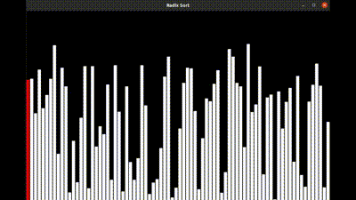
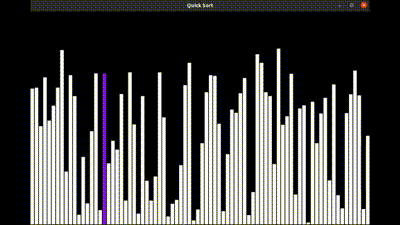
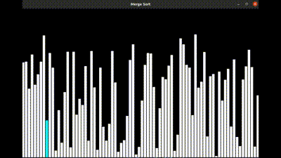

### **Project Name:**
# Sorting Algorithm Visualizer
#### About Project:

- Sorting is this process of arranging a collection of elements in numerical or lexiographical order, either ascending or descending.

- This is a Sorting Algorithm Visualizer implemented using C programming language with GUI.

- It helps in visualising how different sorts work and also gives an idea of how fast they are.

- Sorts included in this projects are :
  1. Bubble Sort
  2. Selection Sort
  3. Insertion Sort
  4. Quick Sort
  5. Merge Sort
  6. Radix Sort

#### How to run the code? (For Linux)

- Install CSFML library from [Here](https://www.sfml-dev.org/download/csfml/)
- For compiling and linking all the graphics to your file , for that use: 

  ```gcc -Wall -O2 filename.c -lcsfml-graphics -lcsfml-window -o filename```
  
    (```-lcsfml-graphics``` to link executable with csfml-graphics library and ```-lcsfml-window``` with csfml-window library.)
    
- Run the executable file, for that use :
  ```./filename```
  
  **For Windows** , Visual Studio is required, any suggestions on how to compile CSFML on windows are most welcome :).

#### Technologies Used:

- C  
- CSFML

#### How it works?

- The coloured line in the white bars shows on which element the sorting is taking place and how the element is getting sorted.
- After doing sorting logically according to the respective sorts, it moves to next element.
- Once the array is sorted, all the bars gets light up with different colour.

#### Working Application 

##### Bubble Sort:


##### Insertion Sort:


##### Selection Sort:


##### Radix Sort:



##### Quick Sort: 



##### Merge Sort:



#### Authors :

- Ritesh Narendra Chaundhari - https://github.com/Ritesh2408
- Sehajdeep Singh - https://github.com/sehajdeep1814


#### **Pull Requests are Welcomed, Giving A Star is appreciated**

