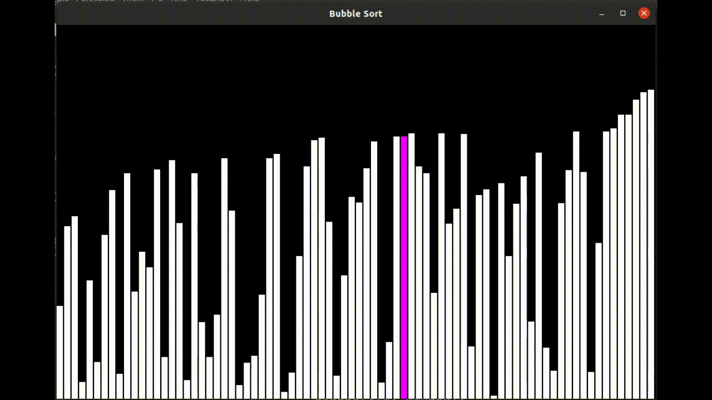
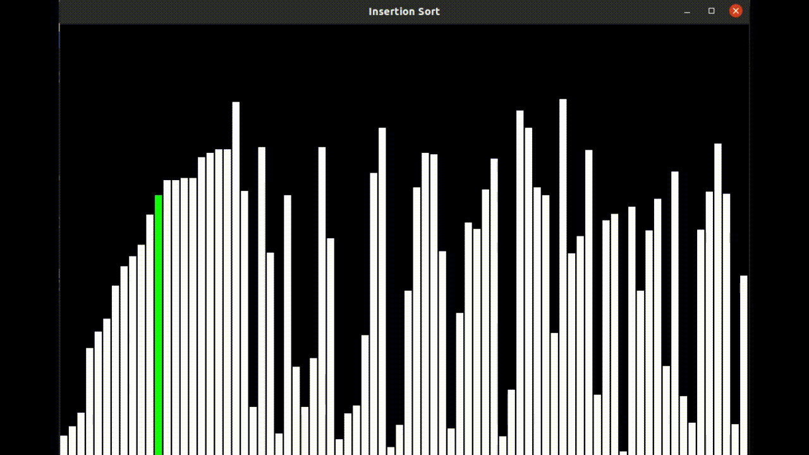
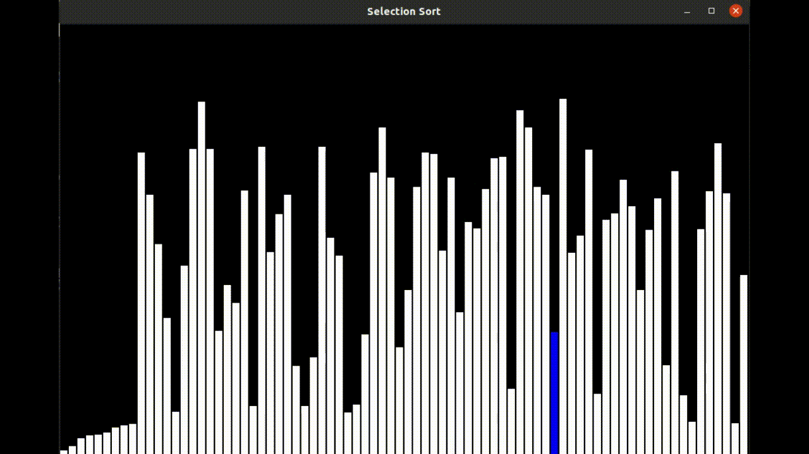

### **Project Name:**
# Sorting Algorithm Visualizer
#### About Project:
- This is a Sorting Algorithm Visualizer implemented using C programming language with GUI.

- It helps in visualising how different sorts work and also gives an idea of how fast they are.

- Sorts included in this projects are :
  1. Bubble Sort
  2. Selection Sort
  3. Insertion Sort
  4. Quick Sort
  5. Merge Sort

#### How to run the code? (For Linux)

- Istall CSFML library from [Here](https://www.sfml-dev.org/download/csfml/)
- For compiling and linking all the graphics to your file , for that use: 

  ```gcc -Wall -O2 filename.c -lcsfml-graphics -lcsfml-window -o filename```
  
    (```-lcsfml-graphics``` to link executable with csfml-graphics library and ```-lcsfml-window``` with csfml-window library.)
    
- Run the executable file, for that use :
  ```./filename```
  
  **For Windows** , Visual Studio is required, any suggestions on how to compile CSFML on windows are most welcome :).

#### Technologies Used:

- C  
- CSFML

#### Working Application 

##### Bubble Sort:

<!--  -->

##### Insertion Sort:



##### Selection Sort:




